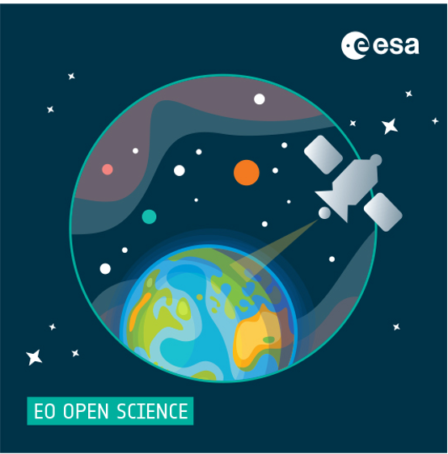

## EarthCODE Portal <!--{as="esa-main-section"}-->

EarthCODE envisions leveraging technology to empower FAIR and Open Earth System Science, 
fostering innovation and collaboration for a sustainable future.

This portal shall provide an entry point to the collaborative
development tools and resources, as well as access to community
guidelines and open documentation to help researchers adopt FAIR
principles in their scientific practice.

Through community and capacity building focused on Open Science, the
activity shall promote a trusted collaborative experience of
conducting Earth system science.

## <!--{as="div" style="display: flex; width: 100%; justify-content: center"}-->
 <!--{style="width: 100%; max-width: 50vw"}-->

## <!--{as="esa-main-section"}-->
EarthCODE is being developed on top of exisiting platform services and will 
leverage the latest tools for managing open data and open source software. 
It aims to grow a community of users that contribute open data and methods, 
discover scientific datasets and workflows, access advanced computing resources 
and collaborate to advance earth science. 

EarthCODE will incrementally develop by integrating readily available Earth Observation 
cloud services and open-source building blocks provided by European industry. 
It also serves as a platform for Open Science capacity building, scientific communication,
and international cooperation.

## Co-develop EarthCODE<!--{as="esa-main-section"}-->
Be part of our mission by sharing your insights. 
Participate in our survey to help shape EarthCODE according to your needs and preferences https://forms.office.com/e/3UbPiq0c0d 

## Join as an Expert or Service Provider<!--{as="esa-main-section"}-->
Keep an eye out for our Q2 2024 best practice procurement to join our subcontractor network.

The procurement will be published as a **"Non ESA Tender Action"** on ESA Star Publication: https://esastar-publication-ext.sso.esa.int/nonEsaTenderActions/filter/open

## I want to publish my scientific findings, how can EarthCODE help? <!--{as="esa-main-section"}-->
After signup, you will be able to access your workspace and create
your first experiment. If your input data, workflow file and resulting
product(s) are located on supported platforms, you can combine them
and add some additional project metadata. After publishing your
experiment, EarhCODE will copy and securly store the data for you and
generate an unique DOI.

## I would like to check if somebody did similar research to the one I am conducting, can I use EarthCODE for that? <!--{as="esa-main-section"}-->
EarthCODE will let you browse projects, experiments and resulting
products created by the entire community. You will be able to search
by title, keywords, publication date and other
metadata.

## I found an interesting experiment, how can I re-run it with my own parameters? <!--{as="esa-main-section"}-->
Each experiment published on EarthCODE will be reproducible (to
varying degrees). If you choose to reproduce a previous experiment,
all the available information (e.g. input data, source code, required
environment) will be pre-loaded, allowing you to either re-run the
experiment with the same parameters, or changing them to build your
own experiment upon it.

## Contact us! 
Does the information provided seem insufficient? Please feel free to get in touch with our team! 
 
<b>Dr Chandra Taposeea-Fisher</b> 
Senior Project Manager 
chandra.taposeea@telespazio.com 
