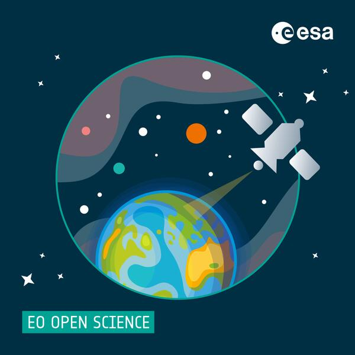

## <!--{as="div" .highlight}-->

### EarthCODE Info Day 17 April 2024 (online)

EarthCODE is looking for subcontractors. The project team will be hosting a supplier webinar at 1.30pm CEST on 17 April, to get information on developing the three main works streams (WS): WS1 - Infrastructure, WS2 - FAIR Open Science & WS3 – Community.

The [Intended ITT](https://esastar-publication-ext.sso.esa.int/nonEsaTenderActions/details/13691) is available as a non-ESA Tender Action on ESA-STAR.

- Date: April 17, 2024
- Time: 13:30 – 15:00 CEST (Madrid, Paris, Rome)
- [Register](https://events.teams.microsoft.com/event/133562f6-0358-4e09-9f4a-789d03381b75@e4fda1e2-a063-48c2-a133-cf4b3c22f5af) by Tuesday 16 April at 1.30pm CEST

## EarthCODE Portal <!--{as="esa-main-section"}-->

EarthCODE envisions leveraging technology to empower FAIR and Open Earth System Science,
fostering innovation and collaboration for a sustainable future.

This portal shall provide an entry point to the collaborative
development tools and resources, as well as access to community
guidelines and open documentation to help researchers adopt FAIR
principles in their scientific practice.

Through community and capacity building focused on Open Science, the
activity shall promote a trusted collaborative experience of
conducting Earth system science.

## <!--{as="div" style="display: flex; width: 100%; justify-content: center"}-->

 <!--{style="width: 100%; max-width: 50vw"}-->

## <!--{as="esa-main-section"}-->

EarthCODE is being developed on top of exisiting platform services and will
leverage the latest tools for managing open data and open source software.
It aims to grow a community of users that contribute open data and methods,
discover scientific datasets and workflows, access advanced computing resources
and collaborate to advance earth science.

EarthCODE will incrementally develop by integrating readily available Earth Observation
cloud services and open-source building blocks provided by European industry.
It also serves as a platform for Open Science capacity building, scientific communication,
and international cooperation.

## <!--{as="div" .highlight}-->

### Co-develop EarthCODE

Be part of our mission by sharing your insights.
Participate in our survey to help shape EarthCODE according to your needs and preferences: [https://forms.office.com/e/3UbPiq0c0d](https://forms.office.com/e/3UbPiq0c0d)

## I want to publish my scientific findings, how can EarthCODE help? <!--{as="esa-main-section"}-->

After signup, you will be able to access your workspace and create
your first experiment. If your input data, workflow file and resulting
product(s) are located on supported platforms, you can combine them
and add some additional project metadata. After publishing your
experiment, EarhCODE will copy and securly store the data for you and
generate an unique DOI.

## I would like to check if somebody did similar research to the one I am conducting, can I use EarthCODE for that? <!--{as="esa-main-section"}-->

EarthCODE will let you browse projects, experiments and resulting
products created by the entire community. You will be able to search
by title, keywords, publication date and other
metadata.

## I found an interesting experiment, how can I re-run it with my own parameters? <!--{as="esa-main-section"}-->

Each experiment published on EarthCODE will be reproducible (to
varying degrees). If you choose to reproduce a previous experiment,
all the available information (e.g. input data, source code, required
environment) will be pre-loaded, allowing you to either re-run the
experiment with the same parameters, or changing them to build your
own experiment upon it.

## Team

Earth Science Collaborative Open Development Environment - EarthCODE - is a project sponsored by the European Space Agency (ESA) as a collaborative project under leadership of Telespazio UK as prime contractor. The contracted partners in the consortium are below.

### Prime Team

[Telespazio UK - Prime Contractor](https://telespazio.co.uk)

[EOX - Portal](https://eox.at)

### Work Stream Consortium

TBD

## Community 

EarthCODE aims to foster a community based on FAIR Open Science Principles throughout ESA-funded Earth System Science activities. Several recent and ongoing initiatives within the EO sector are focussed on the creation of common standards, common architecture, and open-source platforms. EarthCODE aims to deliver long-term persistence of data, code, and documentation, aiding reproducibility, reuse and consumption of research outputs by a wider community. Additionally, the Portal aims to provide access to community information resources and Open Science tools enabling collaboration and adherence to FAIR/open research practices.

If you would like to be a part of this community, please sign up to our newsletter (once it is established) to get more information. We will also hold regular sessions with end-users, so they can contribute understanding the needs of end-users and stakeholders.

## Contact us!

Does the information provided seem insufficient? Please feel free to get in touch with our team!  
**Dr Chandra Taposeea-Fisher**  
Senior Project Manager  
[chandra.taposeea@telespazio.com](mailto:chandra.taposeea@telespazio.com)
