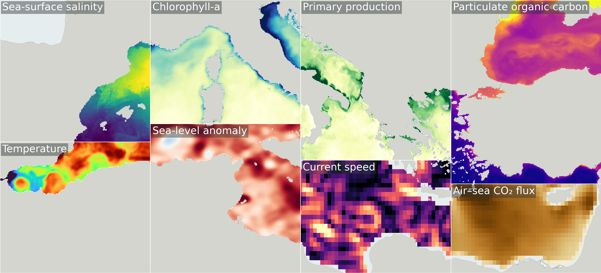
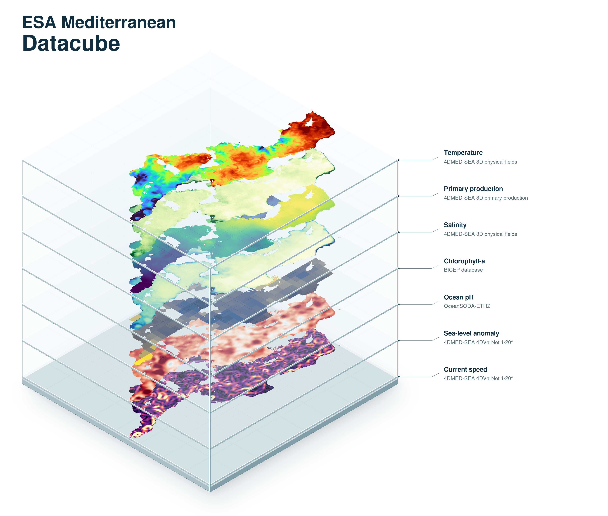

<section class="blue hero">

# ESA Mediterranean Datacube

The **ESA Mediterranean Datacube** is a combined dataset of indicators and variables including temperature, salinity, density, sea level, ocean currents, chlorophyll-a, phytoplankton composition, primary production, ocean heat content, carbonate chemistry, air-sea carbon exchange and others for the Mediterranean Sea. The source products come from ESA Ocean Cluster projects and related research activities. Each source dataset retains its own attribution, licence and scientific reference and remains openly available through the [EarthCODE Open Science Catalogue](https://opensciencedata.esa.int/products/catalog).

The datasets are combined on a common **1/24° latitude-longitude grid in EPSG:4326**, and split in four zarr stores that have different additional dimensions - hourly, daily, monthly  and depth data stores.

The public data stores can be accessed directly over HTTPS. The [ESA Mediterranean Datacube access notebook](https://esa-earthcode.github.io/ocean_hackathon/remote-cube-access/) provides runnable examples.

</section>

<section class="light-grey">

## Collection at a Glance

| Metadata | Description |
| --- | --- |
| **Geographic coverage** | Mediterranean Sea, approximately 6°W-36°E and 30°N-46°N |
| **Scientific scope** | Ocean circulation, physical and biogeochemical conditions, marine productivity, carbon exchange and ocean health |
| **Temporal coverage** | The data covers 2016-2022; Availability varies by source dataset and variable |
| **Spatial resolution** | Common 1/24° grid in EPSG:4326, with coarser summaries at 1/6° and 1/3°; source resolutions vary |
| **Vertical coverage** | Surface variables, depth-resolved fields at 18 levels from 3 to 135 m, and currents at 15 m |
| **Source datasets** | **30+ Datasets** from 20 ESA Ocean Cluster projects in cloud-optimised formats. [Explore the datasets](https://esa-earthcode.github.io/ocean_hackathon/datasets-sumary/) |
| **Data formats** | Cloud-optimised, multiscale GeoZarr |

</section>

<section class="blue hero">

## Mediterranean Datacube

The datacube combines data describing ocean temperature, salinity, circulation, marine productivity and carbon cycling on a common 1/24° grid.

*Example variables from the ESA Mediterranean Datacube*

### Source Datasets

- **4DMED-SEA surface salinity and density:** sea-surface salinity, density and associated uncertainties. [View in the Open Science Catalogue](https://opensciencedata.esa.int/products/4dmed-2d-sss/collection).
- **4DMED-SEA ocean stirring:** finite-size Lyapunov exponents describing the separation of nearby water parcels. [View in the Open Science Catalogue](https://opensciencedata.esa.int/products/4dmed-2d-alt-miost-le-24/collection).
- **4DMED-SEA sea level and geostrophic currents:** sea-level anomaly, absolute dynamic topography, geostrophic velocities and relative vorticity from the 4DVarNet products. View the [1/8° product](https://opensciencedata.esa.int/products/4dmed-2d-alt-varnet-8/collection) and [1/20° product](https://opensciencedata.esa.int/products/4dmed-2d-alt-varnet-20/collection) in the Open Science Catalogue.
- **4DMED-SEA phytoplankton and underwater light:** phytoplankton functional types and diffuse attenuation coefficients. [View in the Open Science Catalogue](https://opensciencedata.esa.int/products/4dmed-2d-pft-kd/collection).
- **4DMED-SEA subsurface physical fields:** temperature, salinity, geostrophic currents and mixed-layer depth. [View in the Open Science Catalogue](https://opensciencedata.esa.int/products/4dmed-t-s-geo-150/collection).
- **4DMED-SEA primary production:** depth-resolved primary production and euphotic-zone depth. [View in the Open Science Catalogue](https://opensciencedata.esa.int/products/4dmed-3d-prim-prod-150/collection).
- **World Ocean Circulation (WOC):** hourly current fields at 15 m, including total, geostrophic and ageostrophic components. [View in the Open Science Catalogue](https://opensciencedata.esa.int/products/total-surface-current-15/collection).
- **Ocean heat content:** ocean heat-content change from satellite-based estimates. [View in the Open Science Catalogue](https://opensciencedata.esa.int/products/4d-atlantic-ohc-global/collection).
- **OceanSODA:** surface carbonate chemistry, including pH, dissolved inorganic carbon, alkalinity and carbonate saturation, together with air-sea CO₂ fluxes and related variables. [View in the Open Science Catalogue](https://opensciencedata.esa.int/products/ocean-soda-ethz/collection).
- **BICEP:** marine primary productivity, export production, particulate organic carbon, phytoplankton carbon and chlorophyll-a. [View in the Open Science Catalogue](https://opensciencedata.esa.int/products/bicep-database/collection).
- **CAREHeat:** marine heatwave categories from the original and detrended sea-surface temperature records. [View in the Open Science Catalogue](https://opensciencedata.esa.int/products/careheat-database/collection).
- **MITHO:** cumulative hazard indices and their contributing stressors, supporting analysis of multiple threats to ocean health. [View in the Open Science Catalogue](https://opensciencedata.esa.int/products/global-cumulative-hazard-indexes-chis/collection).

</section>

<section class="light-grey">

## Built with the Ocean Science Community

EarthCODE supports the [ESA Ocean Science Cluster community](https://earthcode.esa.int/community/scientists/science-clusters) with open data, cloud infrastructure, tools and hackathons. Scientists shape the datacubes by defining priorities, recommending datasets and testing the collections through real research use cases.

*Ocean variables from the ESA Mediterranean Datacube*

Explore the [Mediterranean Datacube notebooks and resources](https://esa-earthcode.github.io/ocean_hackathon/intro/).

</section>

<section class="blue hero">

## Access and Explore

- **Explore the visualisation:** [view the Mediterranean Sea Datacube](https://sunnydean.github.io/ocean_cubes_vis/).
- **Get started:** [open the ESA Mediterranean Sea Datacube access notebook](https://esa-earthcode.github.io/ocean_hackathon/remote-cube-access/).
- **View the collection in the Open Science Catalogue:** Link TBD.
- **View the source datasets:** [browse the dataset overview and access examples](https://esa-earthcode.github.io/ocean_hackathon/datasets-sumary/).
- **Build a small cube:** [resample the source salinity dataset and save a local cube](https://esa-earthcode.github.io/ocean_hackathon/build-single-cube-demo/).
- **Visit the Science Cluster:** [learn about the ESA Ocean Science Cluster and other Science Clusters](https://earthcode.esa.int/community/scientists/science-clusters).
- **Join the discussion:** [ask questions and share ideas in the EarthCODE Forum](https://discourse-earthcode.eox.at/).
- **Contribute code:** [visit the ocean hackathon repository](https://github.com/esa-earthcode/ocean_hackathon).

### Data Stores

- **Monthly ocean variables:** [`ocean-med-monthly-cube.zarr`](https://s3.waw4-1.cloudferro.com/EarthCODE/OSCAssets/med_cubes/ocean-med-monthly-cube.zarr).
- **Daily surface variables:** [`ocean-med-daily-surface-cube.zarr`](https://s3.waw4-1.cloudferro.com/EarthCODE/OSCAssets/med_cubes/ocean-med-daily-surface-cube.zarr).
- **Daily depth-resolved variables:** [`ocean-med-biophysics.zarr`](https://s3.waw4-1.cloudferro.com/EarthCODE/OSCAssets/med_cubes/ocean-med-biophysics.zarr).
- **Hourly currents:** [`hourly_cube.zarr`](https://s3.waw4-1.cloudferro.com/EarthCODE/OSCAssets/med_cubes/hourly_cube.zarr).

The data stores share a common spatial grid but use different time frequencies and depth dimensions. The [access notebook](https://esa-earthcode.github.io/ocean_hackathon/remote-cube-access/) shows how to access and plot selected variables from the collection.

## Contribute

To suggest a dataset, share a use case, or help extend the collection

<a class="VPButton cta" href="mailto:earth-code@esa.int" target="_blank">Contact us</a>

</section>
