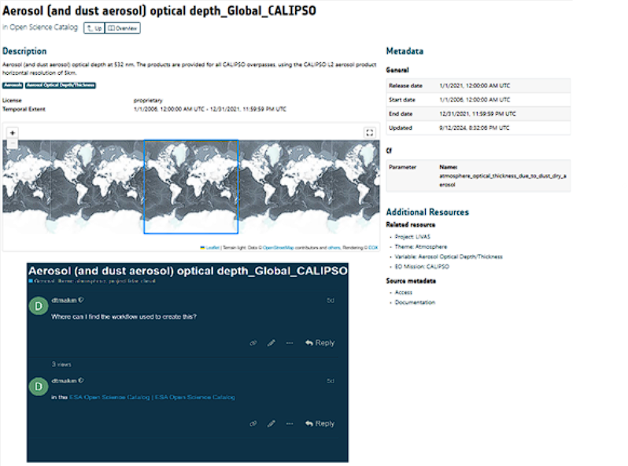

# EarthCODE Discourse Structure

EarthCODE Discourse is organized into categories designed to keep discussions focused and easy to navigate. Each category serves a specific purpose, so it’s important to post your content where it fits best. This helps keep the forum tidy and ensures that others can easily find relevant discussions. 

Before diving in, familiarize yourself with the forum’s [Code of Conduct](https://discourse-earthcode.eox.at/faq). This outlines the expectations for respectful and constructive interactions within the community. 

When you log in, you’ll find the following categories in Discourse: 

# EarthCODE Forum Categories

| **Category**                | **Purpose**                                                     |
|-----------------------------|-----------------------------------------------------------------|
| **General Discussion**      | Introductions, announcements, Q&A                              |
| **Science Clusters & Working Groups** | Domain-specific research discussions                         |
| **EarthCODE Architecture**  | Technical standards and development                            |
| **Technical Support**       | Technical support for EarthCODE and platforms                 |
| **Training and Resources**  | Tutorials and best practices                                   |
| **Data & Workflows**        | Dataset and workflow discussions (autogenerated from the EarthCODE Catalog) |
| **Community Engagement**    | Events and recognition                                         |
| **Feedback and Suggestions**| Feedback on how to improve EarthCODE                          |

# EarthCODE Catalog and Discourse

The **EarthCODE Catalog** is integrated with the **EarthCODE Discourse forum**, making it easy for you to connect discussions directly to the resources you are exploring. This integration allows you to view or join forum discussions right from the catalog, without needing to leave the page you are on. Whether you’re exploring datasets, workflows, experiments, or other catalog items, you can view existing discussions or start new ones with just a few clicks.

## How It Works

When browsing an item in the catalog, you’ll see a **"Discuss This"** option:

- **If a discussion already exists:**  
  You will be able to see all the existing comments on the same page. Clicking **"Discuss This"** will take you directly to the relevant topic in the Discourse forum, where you can join the discussion and add your comments.

- **If no discussion exists:**  
  Clicking **"Discuss This"** will create a new topic on the forum, pre-tagged with metadata from the catalog item. These tags help keep discussions organized and easily searchable.  
  > **Note:** Start discussions only on items you would like to comment on, to keep the forum focused on useful content.

By linking discussions to specific catalog items, EarthCODE ensures that all conversations related to a resource are centralized in one topic. This approach reduces redundancy, keeps the forum tidy, and makes it easier for you to find valuable insights. If needed, you can still create separate posts outside of these linked discussions. 

This integration is more than a convenience—it strengthens the EarthCODE community by encouraging meaningful interactions directly tied to the resources you use, fostering collaboration and knowledge sharing. 

